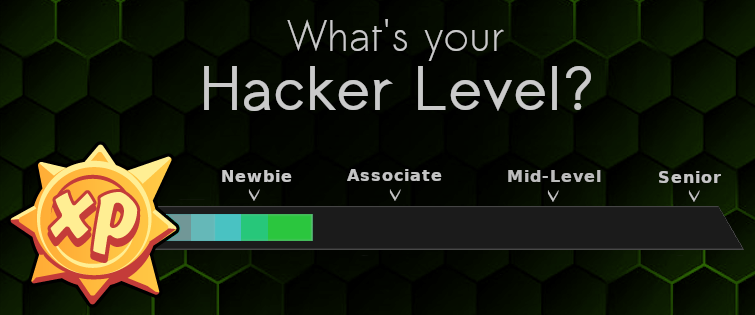
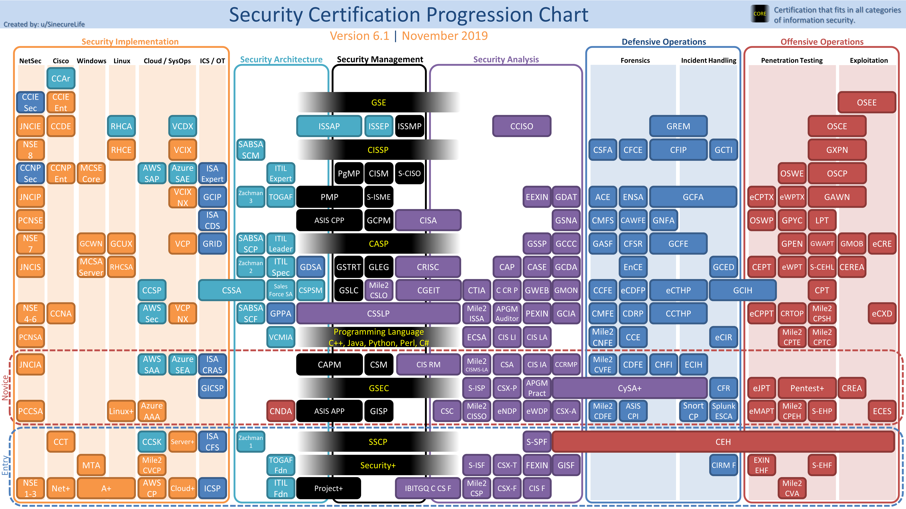

# The Ultimate Hacker Roadmap

  

## Skill Levels
* **[Clueless](https://github.com/Kennyslaboratory/Ultimate-Hacker-Roadmap/tree/main/x00_Clueless)** _(Unhirable)_
  * You really want a any job in IT but are unsure how to transition into an IT job from your current position.
  * You don't understand computing fundaments, code, networking, web technology, or how anything works beyond a very basic fundamental level.
  * Most technical things you've done are operating system installations, virus scans, and putting together a computer from scratch.
* **[Newbie](https://github.com/Kennyslaboratory/Ultimate-Hacker-Roadmap/tree/main/x01_Newbie)** _($30k - $50k)_
  * Already working as IT Support Specialist, IT Consultant, PC Repair Technician, etc.  
  * **Start here if you are not yet a penetration tester!**
  * Can troubleshoot PC problems, backup data, run RJ45 cables, and fix issues with email clients such as Outlook.
  * You might understand a little bit about the Linux CLI, basic BASH Scripting, etc.
  * You will struggle but can likely code your own static Website using HTML, CSS, and some JavaScript.
  * Understands how to troubleshoot computer and network issues.
  * May have an idea or recently discovered the OWASP Top 10, and maybe they've done a few walkthroughs regarding SQL Injection, XSS, and CSRF.
  * Gets the gist of encryption but doesn't understand it fully.  "It has keys and stuff..?"
  * Understands the CIA Triad, generally understands the differences between encryption, hashing, and encoding.
  * Mr. Robot is your favorite TV Series.
* **[Associate](https://github.com/Kennyslaboratory/Ultimate-Hacker-Roadmap/tree/main/x02_Associate)** _($80k - $90k)_
  * Associate Security Consultant, Junior-Level Penetration Tester
  * Understands the OWASP Top 10 and probably recently learned about CORS, OOB-XXE, JWT bugs, Cache Poisoning, OAuth2, and NoSQL Databases.
  * Can do basic code review, but will likely struggle to find more granular vulnerabilities that require fuzzing and advanced debugging.
  * Can build basic tools with Sockets, Regular Expressions, Web Scrapping Libraries, etc.
  * You've played with Web Frameworks and MVC Web Applications.  You are fluent in HTML, CSS, and JavaScript.
  * Proficient with web technologies, understands low-level networking, and is in the process of learning Memory Management in C/C++ and Assembly.
  * Can do a basic stack-based buffer overflow CTF, but will likely fail to bypass DEP, ASLR, etc.
  * May know a slight amount about Mobile Technology but not enough to do a security assessment.
  * Can be hired as a security professional and work professionally but will likely need to be supervised.
  * Might get stumped when trying to bypass certain protections such as firewalls, Content Security Policy, etc.
* **[Mid-Level](https://github.com/Kennyslaboratory/Ultimate-Hacker-Roadmap/tree/main/x03_Mid-Level)** _($95k - $120k)_
  * Security Consultant, Security Engineer, Penetration Tester
  * Can perform code review and work alone in most cases.
  * Proficient enough to work full-time remotely, requires very little oversight.
  * Understands _"The Big 4"_ - Web Applications, Binary Exploitation, Mobile Applications, and Network-Based Attacks.
  * Understands how to Fuzz an application, Heap Spray, do Power Analysis, and enumerate more granular vulnerabilities like Race Conditions, etc.
  * Can build a basic application using services from cloud providers. (AWS, GCP, Azure).
  * Understands how to bypass most protections effectively.
  * Routinely challenges themselves with more complicated CTFs, Labs, and Projects.
  * Can likely develop their own malware or at least script enough to exfilrate the data they want.
  * Enough knowledge to write a fairly useful guide or book on penetration testing.
* **[Senior](https://github.com/Kennyslaboratory/Ultimate-Hacker-Roadmap/tree/main/x04_Senior)** _($120k+)_
  * Senior Security Consultant, Senior Security Engineer, etc.
  * Works very close to the metal.
  * Has attended their fair share of hacker conventions and conferences.
  * Can bypass modern binary protection mechanisms such as DEP, ASLR, Canaries, CFI, Isolated Heaps, etc.
  * Has specialized knowledge in specific technologies. (Vehicles, IoT Devices, Firmware, etc)
  * Can be found writing papers and providing talks at hacker conventions.
  * May have knowledge in Malware Analysis and deobfuscating hardened malware.
  
  -----------
  ## Overview of IT Certifications
  
